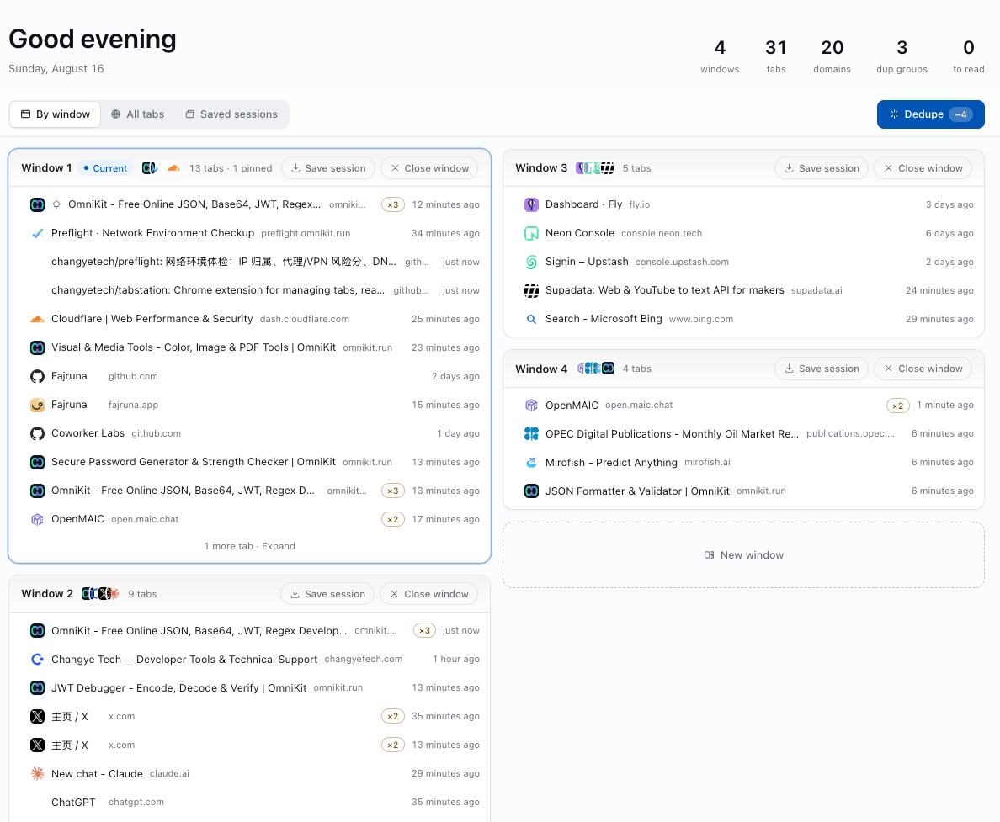
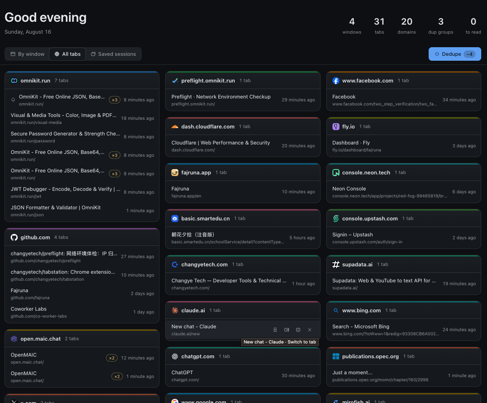

<p align="center">
  
</p>

# Tab Station — 标签工作站

Tab Station 是一个 Chrome Manifest V3 扩展，把所有窗口中的真实标签页集中到一个管理页里操作。它不是只读的标签列表，而是一个「写穿式」操控台：拖拽、移动、关闭、去重都会直接作用于浏览器中的真实标签页。

扩展附带「稍后阅读」与「窗口会话」两类本地持久化数据。没有后端服务，不发起网络请求，全部状态保存在 `chrome.storage.local`。

<p align="center">
  
  <br>
  <em>窗口模式：按窗口分区展示所有真实标签页</em>
</p>

<p align="center">
  
  <br>
  <em>全部模式：跨窗口按域名聚合（深色主题）</em>
</p>

## 功能特性

- **集中管理真实标签页**：在一个页面查看并操作所有窗口的标签页；支持拖拽排序、跨窗口移动、关闭窗口和拆分到新窗口。
- **三种模式**：窗口模式按窗口分区展示，全部模式跨窗口按域名聚合，已保存会话展示可复用的会话卡片。
- **一键去重**：基于全项目统一的 URL 归一化规则识别重复标签页，执行前可预览将保留和关闭的条目，并优先保留固定标签。
- **稍后阅读**：保存时关闭源标签页；打开时自动从清单移除，也支持直接删除或在新窗口打开。
- **窗口会话**：将窗口保存为模板式快照，可反复恢复；会话支持重命名，条目支持排序、单条打开和删除。
- **本地优先与双语界面**：数据仅保存在本机，界面支持中文和英文，并提供浅色、深色、自动三种主题。

## 安装体验

Tab Station 尚未上架 Chrome 应用商店，需要以未打包扩展方式加载。两条路径任选其一。

### 方式一：下载打包产物（无需 Node 环境）

1. 在仓库的 [Releases](../../releases) 页面下载最新的 `tab-station-<version>.zip`。
2. 解压到一个固定目录——Chrome 会持续引用该目录，删掉扩展就失效。
3. 打开 Chrome 的 `chrome://extensions/`，开启右上角的「开发者模式」。
4. 点击「加载已解压的扩展程序」，选择解压出的目录（目录里应能直接看到 `manifest.json`）。

### 方式二：从源码构建

1. 安装 [Node.js](https://nodejs.org/) 和 [pnpm](https://pnpm.io/)。
2. 在仓库根目录安装依赖并构建：

   ```bash
   pnpm install
   pnpm build
   ```

3. 打开 Chrome 的 `chrome://extensions/`。
4. 开启右上角的「开发者模式」。
5. 点击「加载已解压的扩展程序」，选择仓库下的 `dist/` 目录。

装好后，点击工具栏中的 Tab Station 图标，或使用默认快捷键 `Ctrl+Shift+E`（macOS 为 `Command+Shift+E`）打开管理页。

## 开发指南

项目使用 React 18、TypeScript、Vite 和 Vitest。扩展没有传统 dev server 或 HMR；`pnpm dev` 运行的是产物型 watch 构建，输出到 `dist/`。

```bash
make install     # pnpm install
make dev         # vite build --watch
make build       # tsc --noEmit && vite build
make package     # 构建并把 dist/ 打成 tab-station-<version>.zip
make test        # vitest run
make lint        # eslint .
make typecheck   # tsc --noEmit
make fmt         # prettier --write .
make check       # fmt-check + lint + typecheck + test
```

日常开发流程：

1. 执行 `make dev` 启动 watch 构建。
2. 在 `chrome://extensions/` 中加载或刷新 `dist/` 扩展。
3. 修改管理页或设置页后，刷新对应 Chrome 标签页即可。
4. 修改 `background.ts`、`manifest.json` 或 `_locales/` 后，需要点击扩展卡片上的刷新按钮。

更完整的 MV3 调试说明见[本地调试手册](docs/local-debugging.md)。

## 持续集成与发布

仓库通过 GitHub Actions 提供两条自动化流水线，定义在 `.github/workflows/`。

| 流水线 | 触发条件 | 做什么 |
| --- | --- | --- |
| `ci.yml` | push 到 `main`、针对 `main` 的 PR | `make check` + `make build` |
| `release.yml` | 推送 `v*` 形式的 tag | 校验版本 → `make check` → `make package` → 创建 GitHub Release 并上传 zip |

CI 跑的是与本地完全相同的 `make check`，因此本地绿灯基本等价于 CI 绿灯。

### 版本号的唯一来源

版本号只写在 `package.json` 的 `version` 字段里。

- `public/manifest.json` **不含** `version` 字段，构建时由 Vite 插件从 `package.json` 注入到 `dist/manifest.json`。所以 `public/` 目录本身不是一个可加载的扩展目录，加载和分发一律用 `dist/`。
- git tag 不是版本来源，而是一次断言：Release 流水线会校验 tag（去掉 `v` 前缀）与 `package.json` 的 `version` 严格相等，不一致就立即失败，不会产出 Release。

### 发布一个版本

```bash
# 1. 修改 package.json 的 version，例如 0.1.0 -> 0.2.0
# 2. 本地自检并确认产物可用
make check
make package

# 3. 提交并推送版本变更
rtk git add package.json && rtk git commit -m "chore: release v0.2.0" && rtk git push

# 4. 打同名 tag 并推送，触发 Release 流水线
rtk git tag v0.2.0 && rtk git push origin v0.2.0
```

tag 名中带连字符（如 `v0.2.0-beta.1`）会被自动标记为预发布。Release 说明由 GitHub 依据提交记录自动生成。

流水线失败时的常见原因：tag 与 `package.json` 版本不一致；或仓库 Settings → Actions → Workflow permissions 未允许写入，导致创建 Release 返回 403。

### 上架 Chrome 应用商店

尚未接入。Chrome Web Store 提供官方 API，上传新版本与提交审核都可以自动化，但**首次创建商店条目必须人工完成**（需注册开发者账号，含一次性注册费，金额以官方页面为准），API 只能更新已存在的条目。拿到 extension ID 之后才能把自动上传接进 `release.yml`。设计与分期见[发布自动化 spec](docs/specs/2026-08-17-release-automation.md)。

## 项目结构

```text
tabstation/
├── public/               # manifest.json、多语言文案与图标
├── src/
│   ├── background.ts     # MV3 service worker，负责打开管理页单例
│   ├── manager/          # 管理页 React 入口
│   ├── settings/         # 设置页 React 入口
│   ├── components/       # 管理页 UI 组件
│   ├── hooks/            # chrome.* 与 React state 的桥接
│   ├── lib/              # 领域逻辑、数据模型与纯函数
│   ├── i18n/             # 页面层多语言支持
│   ├── styles/           # 设计 token 与样式
│   └── test/             # chrome mock 与测试工具
├── docs/                 # 约定文档、设计规格与实施计划
└── design/               # 品牌与设计交付物
```

分层约定：

- `src/lib/` 存放不依赖 React 的领域逻辑和数据模型。
- `src/hooks/` 将 `chrome.storage` 与 `chrome.tabs` 事件桥接为 React state。
- `src/components/` 存放管理页组件，并按组件配套测试。
- `src/manager/` 与 `src/settings/` 是两个独立 UI 入口。

## 权限与隐私

扩展只申请以下权限：

| 权限 | 用途 |
| --- | --- |
| `tabs` | 读取和操作真实标签页与窗口 |
| `storage` | 在本机保存设置、稍后阅读和窗口会话 |
| `favicon` | 使用 Chrome 本地 favicon 数据展示站点图标 |

Tab Station 没有后端服务，不上传浏览记录，也不做数据分析。

## 相关文档

- [领域词汇表](CONTEXT.md)
- [项目开发约定](CLAUDE.md)
- [产品命名规范](docs/naming.md)
- [本地调试手册](docs/local-debugging.md)
- [产品路线图](ROADMAP.md)
